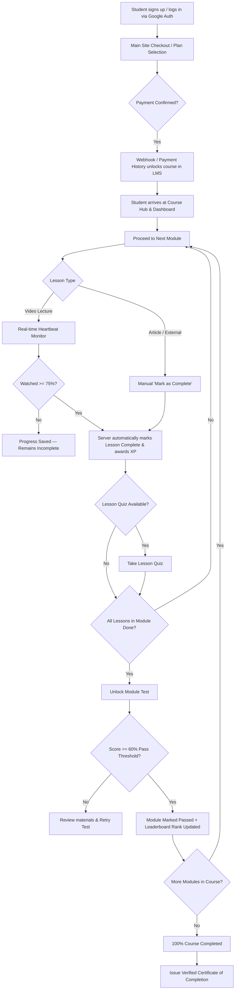

# 🎓 Planitt Learn — Overall Student Learning Journey

> **Notice for Landing Page / Main Website Integration:**  
> This document outlines the complete **Learning Journey** implemented in the **Planitt Learn LMS platform**. It includes both the **Landing Page Content & Structure** (ready to incorporate into your main website landing page) and the **Underlying Platform Workflow & Verification Logic**.

---

## 🌟 1. Landing Page Section: "The 6-Step Learning Journey"
*(Use this structure and copy directly on your main website / landing page hero or workflow section)*

```
       [ 1. Discover & Enroll ]
                 │
                 ▼
     [ 2. Personalized Dashboard ]
                 │
                 ▼
      [ 3. Bite-Sized Lessons ] ───▶ (Strict 75% Video Completion Gate)
                 │
                 ▼
      [ 4. Knowledge Checks ]   ───▶ (Lesson Quizzes + Pass-gated Module Tests)
                 │
                 ▼
     [ 5. Gamified XP & Ranks ] ───▶ (Badges & Global Leaderboard)
                 │
                 ▼
   [ 6. Verified Certification ]
```

### 📋 Feature Cards for Homepage / Landing Page

#### **Step 1: Seamless Course Discovery & Instant Enrollment**
- **Headline:** Instant Access to Industry-Grade Trading Tracks
- **Description:** Choose from specialized programs—Indian Stocks, Forex, FnO Strategies, Crypto, Trading Psychology, or Algo Trading—or unlock everything with the **All-Courses Combo Pass**.
- **User Action:** Single click checkout on main site triggers instant automated enrollment into the LMS portal.

#### **Step 2: Command Center Dashboard**
- **Headline:** Stay Oriented with Your Personal Learning Hub
- **Description:** Track your active progress, total watch duration, streak days, and resume exactly where you left off with a single tap.
- **Key Metrics:** Overall Course Progress (%), Lessons Completed, Completed Modules, Active Streak.

#### **Step 3: Interactive Lessons & 75% Completion Mastery Rule**
- **Headline:** Quality Education Built on Real Engagement
- **Description:** Access high-definition video lectures, deep-dive articles, and external tools. To ensure genuine mastery, video lessons enforce a **75% minimum watch completion rule** before unlocking progression.
- **Key Technology:** Real-time background watch heartbeat tracking.

#### **Step 4: Lesson Quizzes & Pass-Gated Module Tests**
- **Headline:** Validate Your Skills Before Moving Forward
- **Description:** Reinforce concepts after each video with instant interactive quizzes. Complete each module by taking a comprehensive **Module Test** (requires a passing score of 60%+) to unlock subsequent course phases.
- **Feedback:** Real-time score breakdown and detailed answer reviews.

#### **Step 5: Gamified Progression & Global Leaderboard**
- **Headline:** Compete, Level Up, and Earn Bragging Rights
- **Description:** Earn XP points for every watched lesson, quiz passed, and test aced. Climb the course-wide and global **Student Leaderboards** and unlock achievement badges.
- **Rewards:** Achievement Badges, XP Points, Leaderboard Ranking.

#### **Step 6: Verified Certificate of Achievement**
- **Headline:** Showcase Your Market Readiness
- **Description:** Complete 100% of course lessons and pass all required module assessments to receive your official **Planitt Verified Certificate of Completion**.
- **Sharing:** Downloadable PDF and verifiable badge to share on LinkedIn or resume.

---

## ⚙️ 2. Platform Technical & Functional Workflow

The diagram below details how a student moves through the system from initial sign-up to course certification.



---

## 📊 3. Core Engine Mechanics & Business Logic

| Component | Technical Implementation | Business Rule / Standard |
| :--- | :--- | :--- |
| **Authentication & Auth Sync** | Google OAuth + Unified Appbackend JWT (`alvest_learn_user`) | Single sign-on across main site and LMS |
| **Course Access & Locking** | Payment History API fallback + Webhook receiver | Lock/Unlock per course ID (`learn-*`) or Combo Pass |
| **Watch Tracking Gate** | HTML5 / YouTube video player heartbeat API (`/api/v1/lessons/[id]/progress`) | **75% Watch Rule**: Server refuses completion if watched time < 75% |
| **Assessment System** | JSON-based question bank (`passingScore: 60%`) | Must pass module tests to mark module complete |
| **Leaderboard Engine** | Real-time / Scheduled DB aggregation (`LeaderboardEntry`) | Ranked by Total Points (XP) + Completion % |
| **Resume Engine** | `getContinueLessonUrl()` matching first incomplete lesson | Automatic redirection to active lesson |

---

## 💡 4. Ready-to-Use Website HTML/JSX Layout Snippet

Below is a component-ready structure to paste directly into your Next.js / React landing page:

```tsx
export function LearningJourneySection() {
  const steps = [
    {
      step: "01",
      title: "Enroll & Unlock Access",
      desc: "Pick your specialized trading track or unlock the full library with our Combo Pass.",
      icon: "🎯"
    },
    {
      step: "02",
      title: "Interactive Command Center",
      desc: "Track your active progress, streak days, and total watch time from one intuitive dashboard.",
      icon: "📊"
    },
    {
      step: "03",
      title: "Structured Video Lectures & 75% Rule",
      desc: "Learn from high quality video lessons with a built-in 75% completion standard to ensure actual retention.",
      icon: "🎥"
    },
    {
      step: "04",
      title: "Quizzes & Pass-Gated Module Tests",
      desc: "Test your knowledge after every module with passing thresholds before advancing.",
      icon: "✍️"
    },
    {
      step: "05",
      title: "XP, Badges & Leaderboards",
      desc: "Earn XP points, unlock achievements, and compete with peers on the global leaderboard.",
      icon: "🏆"
    },
    {
      step: "06",
      title: "Verified Certificate",
      desc: "Earn a verifiable certificate of completion upon clearing 100% of course requirements.",
      icon: "📜"
    }
  ];

  return (
    <section className="py-20 bg-slate-950 text-white">
      <div className="max-w-6xl mx-auto px-4 text-center">
        <h2 className="text-3xl md:text-4xl font-bold tracking-tight text-brand">
          How Your Learning Journey Works
        </h2>
        <p className="mt-4 text-slate-400 max-w-2xl mx-auto">
          A structured, gamified, and quality-driven roadmap designed to take you from foundational concepts to market mastery.
        </p>

        <div className="mt-16 grid grid-cols-1 md:grid-cols-2 lg:grid-cols-3 gap-8">
          {steps.map((s) => (
            <div key={s.step} className="p-6 rounded-2xl bg-slate-900/60 border border-slate-800 text-left hover:border-brand transition-colors">
              <div className="flex items-center justify-between">
                <span className="text-3xl">{s.icon}</span>
                <span className="text-xs font-mono font-bold text-slate-500">{s.step}</span>
              </div>
              <h3 className="mt-4 text-lg font-semibold text-white">{s.title}</h3>
              <p className="mt-2 text-sm text-slate-400 leading-relaxed">{s.desc}</p>
            </div>
          ))}
        </div>
      </div>
    </section>
  );
}
```

---

## 📌 Summary for Integration

1. **For Landing Page Design:** Copy Section 1 (Feature Cards) or Section 4 (React Component Code) directly to render on `planitt.in`.
2. **For Content & Marketing Copy:** Use the 6 distinct steps to explain to students how the platform guarantees deep learning through the 75% video rule and pass-gated module tests.
3. **For Developer Integration:** Reference Section 2 & 3 to verify how the LMS backend validates progress, stores enrollments, and updates leaderboards.
